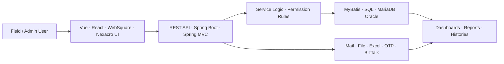

<p align="center">
  
</p>

<h3 align="center">운영 업무 흐름을 화면, API, SQL까지 연결해 구현하는 웹 개발자</h3>

<p align="center">
  <strong>Full-stack web developer focused on admin systems, workflow-heavy UIs, Spring APIs, and data-driven operations tools.</strong>
</p>

<p align="center">
  <a href="https://portfolio-six-inky-14.vercel.app/">
    
  </a>
  <a href="https://github.com/YongjaeKwon/portfolio">
    
  </a>
  <a href="mailto:koj185364@naver.com">
    
  </a>
</p>

## Recruiter Snapshot

| Item | Detail |
| --- | --- |
| Current focus | Frontend/Web development for B2B/B2G operations systems and admin tools |
| Core stack | Vue, React, TypeScript, Java, Spring Boot, Spring MVC, MyBatis, MariaDB, Oracle |
| Best-fit roles | Frontend Developer, Web Developer, Product-minded Full-stack Developer |
| Strong signal | I connect UI states, API responses, SQL conditions, permissions, and external integrations into complete work flows. |
| Portfolio | [Live site](https://portfolio-six-inky-14.vercel.app/) · [Repository](https://github.com/YongjaeKwon/portfolio) |
| Privacy note | Professional work is summarized without confidential code, data, internal screenshots, or client-sensitive details. |

## About

운영 시스템과 관리자 도구를 개발하며 화면, API, SQL, 외부 연동 흐름을 함께 봅니다.

사용자가 실제로 처리하는 등록, 업로드, 발송, 조회, 이력 확인 흐름이 끊기지 않도록 구현하는 데 관심이 많습니다. 단순히 화면을 만드는 것보다, 권한 조건과 데이터 기준, 외부 연동 결과가 실제 업무 순서와 맞물리는지 확인하며 개발합니다.

```text
I turn messy business workflows into calm, traceable web systems.
```

## Engineering Focus

| Area | What I Care About |
| --- | --- |
| Operation UI | 운영자가 반복해서 쓰는 목록, 상세, 검색, 발송, 이력 확인 화면을 안정적으로 구현합니다. |
| API & State | 성공, 실패, 대기, 예외 응답을 화면 메시지와 버튼 상태로 연결합니다. |
| Data Conditions | 권한, 조직, 기간, 상태값이 SQL과 화면 필터에서 같은 기준으로 동작하는지 확인합니다. |
| Integration | 메일, 파일, 엑셀, 인증, 알림 발송처럼 실패 케이스가 있는 연동 흐름을 다룹니다. |
| Product Thinking | 사용자가 어떤 업무를 끝내야 하는지부터 보고, 기능 단위보다 흐름 단위로 구현합니다. |

## System Map



## Stack

<p align="center">
  
</p>

**Frontend**

Vue, React, Next.js, TypeScript, JavaScript, HTML, CSS, TailwindCSS, WebSquare, Nexacro, JSP, jQuery

**Backend & Data**

Java, Spring Boot, Spring MVC, Spring Security, MyBatis, FastAPI, Python, MariaDB, Oracle, PostgreSQL, Redis

**Tools & Workflow**

Git, SVN, Docker, Docker Compose, Nginx, Vite, Maven, Gradle, Tabulator, Chart.js

## Featured Work

| Project | Role | Personally owned |
| --- | --- | --- |
| TGS 협력사 포탈 시스템 | Backend + Vue UI | 교육 등록, 대상자 업로드, 메일 발송, 제출 현황 조회, 댓글 공통화, OTP 예외 처리 |
| TSMS / IDCMS AS 업무 시스템 | Frontend Lead | 모바일 AS 접수, 개인정보 동의, QR 확인, 태블릿 전자서명, 알림톡 결과 처리 |
| 교육청 IT 자산관리 솔루션 | Backend + UI | 권한별 조회 범위, 자산 현황, 대시보드 집계, 상태 변경, 이력 조회 |
| SR30 물류관리시스템 | Operation Feature Development | 일정, 설문, 물류·재고, 리포트, KPI, 엑셀 다운로드, 관리자 이력 조회 |

## Open Projects

| Project | What it shows | My contribution | Link |
| --- | --- | --- | --- |
| Portfolio | Role-focused Vue portfolio for professional and personal projects | Positioning, track-based content, public resumes, case studies, Vercel deployment | [Live](https://portfolio-six-inky-14.vercel.app/) · [Repo](https://github.com/YongjaeKwon/portfolio) |
| ddoing | React drawing game connected with AI inference for English learning | PM, Main Page, Drawing Page, Canvas game flow, inference API integration | [Repo](https://github.com/GomGom-Team/ddoing) |
| MODAC | Vue learning-room and feed platform for developers | Study room flow, feed/article UI, WebSocket room state, Pinia state handling | [Repo](https://github.com/YongjaeKwon/MODAC) |
| SSAFAST | Next.js tool that connects API specs, request tests, use-case tests, and performance tests | Performance test UI, URL verification flow, nested DTO forms, SSR-safe modal | [Repo](https://github.com/SSAFAST/ssafast) |
| agent-bridge | AI-assisted blog posting support program | Agent workflow experiment and automation tooling | [Repo](https://github.com/YongjaeKwon/agent-bridge) |
| quant-core | React/FastAPI quant trading system learning project | Auth, WebSocket event flow, backtest UI, Docker Compose service split | Private Lab |

<details>
<summary>GitHub metrics</summary>

<p align="center">
  
</p>

<p align="center">
  
  
  
</p>

<p align="center">
  
  
</p>

</details>

<p align="center">
  
</p>
