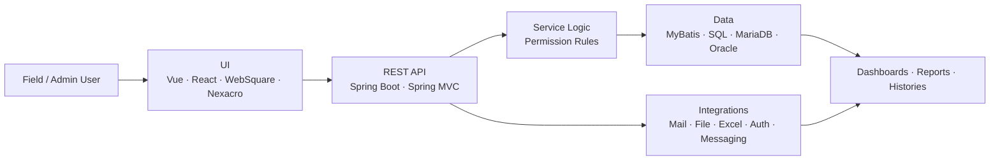

<!-- ============================ HERO ============================ -->
<a href="https://portfolio-six-inky-14.vercel.app/">
  
</a>

<p align="center">
  <a href="https://github.com/YongjaeKwon?tab=repositories">
    
  </a>
</p>

<p align="center">
  <a href="https://portfolio-six-inky-14.vercel.app/">
    
  </a>
  <a href="https://github.com/YongjaeKwon/portfolio">
    
  </a>
  <a href="mailto:koj185364@naver.com">
    
  </a>
</p>

<!-- ============================ INTRO ============================ -->
<h3 align="center">운영·관리자 화면을 만들고, API·SQL·외부 연동 흐름까지 함께 확인하는 프론트엔드 개발자</h3>

<p align="center">
  Frontend developer for <b>admin systems and workflow-heavy operations tools</b> —<br/>
  comfortable reading the API, the state, and the SQL behind every screen.
</p>

---

## 👋 Recruiter Snapshot

<table>
  <tr>
    <td width="180"><b>Focus</b></td>
    <td>Frontend for B2B / B2G operations systems and admin tools</td>
  </tr>
  <tr>
    <td><b>Core stack</b></td>
    <td><b>Production:</b> Vue · JavaScript · Spring · MyBatis &nbsp;|&nbsp; <b>Side projects:</b> React · TypeScript · Next.js · FastAPI</td>
  </tr>
  <tr>
    <td><b>Best-fit roles</b></td>
    <td>Frontend Developer · Admin / Internal-Tools Developer · API-&-Data-aware Frontend</td>
  </tr>
  <tr>
    <td><b>Why me</b></td>
    <td>I connect UI states, API responses, SQL conditions, permissions, and external integrations into one working flow — not just the screen.</td>
  </tr>
  <tr>
    <td><b>Links</b></td>
    <td><a href="https://portfolio-six-inky-14.vercel.app/">Live portfolio</a> · <a href="https://github.com/YongjaeKwon/portfolio">Portfolio repo</a></td>
  </tr>
</table>

> Professional work is summarized without confidential code, data, internal screenshots, or client-sensitive details.

## 🧭 About

운영 시스템과 관리자 도구를 개발하며 **화면 · API · SQL · 외부 연동 흐름을 함께** 봅니다.
사용자가 실제로 처리하는 등록 · 업로드 · 발송 · 조회 · 이력 확인 흐름이 끊기지 않도록 구현하는 데 관심이 많습니다. 단순히 화면을 만드는 것보다, **권한 조건 · 데이터 기준 · 외부 연동 결과가 실제 업무 순서와 맞물리는지** 확인하며 개발합니다.

```text
I turn messy business workflows into calm, traceable web systems.
```

## 🎯 What I Care About

| Area | Focus |
| --- | --- |
| **Operation UI** | 운영자가 반복해서 쓰는 목록 · 상세 · 검색 · 발송 · 이력 화면을 안정적으로 구현 |
| **API & State** | 성공 · 실패 · 대기 · 예외 응답을 화면 메시지와 버튼 상태로 정확히 연결 |
| **Data Conditions** | 권한 · 조직 · 기간 · 상태값이 SQL과 화면 필터에서 같은 기준으로 동작하는지 확인 |
| **Integration** | 메일 · 파일 · 엑셀 · 인증 · 외부 메시지 발송처럼 실패 케이스가 있는 연동 처리 |
| **Workflow Thinking** | 기능 단위가 아니라 *사용자가 끝내야 하는 업무* 단위로 흐름을 설계 |

## 🛠️ Tech Stack

<p align="center">
  
</p>

<table>
  <tr>
    <td><b>Frontend</b></td>
    <td>Vue · React · Next.js · TypeScript · JavaScript · HTML · CSS · TailwindCSS · WebSquare · Nexacro · JSP · jQuery</td>
  </tr>
  <tr>
    <td><b>Backend & Data</b></td>
    <td>Java · Spring Boot · Spring MVC · Spring Security · MyBatis · FastAPI · Python · MariaDB · Oracle · PostgreSQL · Redis</td>
  </tr>
  <tr>
    <td><b>Tools & Ops</b></td>
    <td>Git · SVN · Docker · Docker Compose · Nginx · Vite · Maven · Gradle · Tabulator · Chart.js</td>
  </tr>
</table>

## 🗺️ How I See a System



## 💼 Featured Work

> Roles and ownership; sensitive details intentionally omitted.

| Project | Role | What I personally owned |
| --- | --- | --- |
| **B2B 협력사 운영 포탈** | Backend + Vue UI | 교육 등록, 대상자 업로드, 메일 발송, 제출 현황 조회, 댓글 공통화, 인증 예외 처리 |
| **AS 접수·전자서명 시스템** | Frontend Lead | 모바일 AS 접수, 개인정보 동의, QR 확인, 태블릿 전자서명, 외부 메시지 결과 처리 |
| **교육청 IT 자산관리 솔루션** | Backend + UI | 권한별 조회 범위, 자산 현황, 대시보드 집계, 상태 변경, 이력 조회 |
| **물류·서비스 운영 시스템** | Operation Feature Dev | 일정, 설문, 물류·재고, 리포트, KPI, 엑셀 다운로드, 관리자 이력 조회 |

## 🌱 Open Projects

| Project | What it shows | My contribution | Link |
| --- | --- | --- | --- |
| **Portfolio** | Role-focused Vue portfolio (professional + personal tracks) | Frontend/API/Data tracks, case studies, Vercel deploy | [Live](https://portfolio-six-inky-14.vercel.app/) · [Repo](https://github.com/YongjaeKwon/portfolio) |
| **ddoing** | React drawing game with AI inference for English learning | PM · main/drawing pages · canvas game flow · inference API | [Repo](https://github.com/GomGom-Team/ddoing) |
| **MODAC** | Vue learning-room & feed platform for developers | Study-room flow · feed UI · WebSocket room state · Pinia | [Repo](https://github.com/YongjaeKwon/MODAC) |
| **SSAFAST** | Next.js tool linking API specs, request/use-case/perf tests | Performance-test UI · URL verification · nested DTO forms · SSR-safe modal | [Repo](https://github.com/SSAFAST/ssafast) |
| **agent-bridge** | AI-assisted blog posting helper | Agent workflow experiment & automation tooling | [Repo](https://github.com/YongjaeKwon/agent-bridge) |
| **quant-core** | React/FastAPI quant-trading learning project | Auth · WebSocket events · backtest UI · Docker Compose split | Private Lab |

<!-- ============================ STATS ============================ -->
<details>
  <summary><b>📊 GitHub Activity</b></summary>
  <br/>
  <p align="center">
    
  </p>
  <p align="center">
    
    
    
  </p>
  <p align="center">
    
    
  </p>
</details>

<!-- ============================ FOOTER ============================ -->

