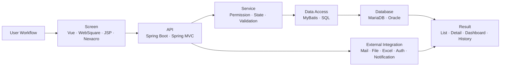

<!-- ============================ HERO ============================ -->
<a href="https://portfolio-six-inky-14.vercel.app/">
  
</a>

<h3 align="center">운영자가 매일 쓰는 화면부터 API·SQL·외부 연동까지 직접 맞춰 보는 웹 개발자</h3>

<p align="center">
  Vue 기반 관리자 화면을 주력으로 개발해 왔고,<br/>
  Spring MVC API와 MyBatis 조회 조건까지 직접 대조하며 화면 결과와 실제 데이터가 어긋나지 않게 만듭니다.
</p>

<p align="center">
  <a href="https://portfolio-six-inky-14.vercel.app/">
    
  </a>
  <a href="https://portfolio-six-inky-14.vercel.app/resume.pdf">
    
  </a>
  <a href="https://portfolio-six-inky-14.vercel.app/resume-backend.pdf">
    
  </a>
  <a href="https://portfolio-six-inky-14.vercel.app/resume-fullstack.pdf">
    
  </a>
  <a href="mailto:koj185364@naver.com">
    
  </a>
</p>

---

## Recruiter Snapshot

| | |
| --- | --- |
| **Current role** | 웹 개발자, 유한책임회사 티지나래 · 2024.06 ~ 재직 중 |
| **Primary focus** | B2B·B2G 운영 시스템, 관리자·모바일 화면, API·SQL·외부 연동 흐름 |
| **Best-fit tracks** | Front-end Developer · Back-end Developer · Fullstack Web Developer |
| **Production stack** | Vue.js, JavaScript, WebSquare, JSP, Nexacro, jQuery, Java, Spring Boot, Spring MVC, Spring Security, MyBatis, MariaDB, Oracle |
| **Project stack** | React, TypeScript, Next.js, Zustand, Redux, FastAPI (개인 프로젝트(quant-core)), PostgreSQL, Redis, Docker |
| **Certificate** | SQLD (SQL 개발자) · 2024.09 취득 |

> Professional work is summarized without confidential code, internal screenshots, client data, or company-sensitive details.

## About Me

B2B·B2G 운영 시스템에서 **화면 구현, API 응답, 권한 조건, MyBatis 조회 기준, 외부 연동 결과**를 직접 대조하며 기능을 만들어 왔습니다.

운영 화면은 버튼과 그리드만 맞으면 끝나는 일이 아니라고 생각합니다. 등록, 업로드, 발송, 조회, 이력 확인처럼 운영자가 반복하는 흐름에서 **화면에 보이는 값과 서버에서 조회·저장되는 데이터가 맞아떨어지는지** 끝까지 확인합니다.

```text
I build calm, traceable web systems for messy business workflows.
```

## Portfolio Tracks

| Track | What I emphasize | Resume |
| --- | --- | --- |
| **Front-end** | Vue 기반 관리자 화면, 상태 분기, API 응답과 화면 결과 정합성 | [resume.pdf](https://portfolio-six-inky-14.vercel.app/resume.pdf) |
| **Back-end** | Spring MVC API, Controller·Service·Mapper, MyBatis 동적 SQL, 외부 연동 응답 처리 | [resume-backend.pdf](https://portfolio-six-inky-14.vercel.app/resume-backend.pdf) |
| **Fullstack** | 화면 요구사항에서 API·Service·SQL·파일·메일·인증 연동까지 이어지는 기능 구현 | [resume-fullstack.pdf](https://portfolio-six-inky-14.vercel.app/resume-fullstack.pdf) |

## What I Bring

| Area | How I work |
| --- | --- |
| **관리자·운영 화면** | 검색, 그리드, 상세, 모달, 파일 업로드, 엑셀 다운로드처럼 반복되는 화면을 상태와 예외 기준까지 포함해 구현합니다. |
| **API 응답과 화면 상태** | 성공·실패·대기·예외 응답을 버튼, 메시지, 재조회 흐름으로 연결해 운영자가 다음 행동을 판단할 수 있게 만듭니다. |
| **권한·조회 조건** | 권한, 조직, 기간, 상태값 조건이 화면 필터와 MyBatis SQL에 어긋나지 않게 직접 추적합니다. |
| **외부 연동** | 메일, 파일, 엑셀, 인증, 알림처럼 실패가 잦은 연동을 요청부터 결과 응답까지 확인합니다. |
| **업무 흐름 설계** | 기능 단위보다 사용자가 실제로 끝내야 하는 업무 단위로 등록→처리→확인 흐름을 묶습니다. |

## Representative Work

| Project | Role | Personal ownership |
| --- | --- | --- |
| **B2B 협력사 운영 포탈 (PPS)** | 백엔드 및 Vue 화면 개발 | 교육 등록, 대상자 업로드, 메일 발송, 제출 현황 조회, 댓글 공통화, 인증 예외, 공지 읽음 이력 처리 |
| **AS 접수·전자서명 업무 시스템** | 프론트엔드 주담당 | 모바일 AS 접수, 개인정보 동의, QR 확인, 태블릿 전자서명, 파일 조회·업로드, 외부 메시지 결과 반영 |
| **교육청 IT 자산관리 솔루션** | 백엔드 및 화면 개발 | 교육청·학교·부서 권한별 조회 범위, 자산 현황, 유상처리 현황, 대시보드 집계, 상태별 SQL 개선 |
| **물류·서비스 운영 시스템** | 운영 기능 개선 및 신규 기능 개발 | 일정, 설문, 물류·재고, 리포트, KPI, 엑셀 다운로드, 관리자 이력 조회 화면 개선 |

## Open Projects

| Project | What it shows | Link |
| --- | --- | --- |
| **Portfolio** | Front-end / Back-end / Fullstack 트랙별 포트폴리오와 PDF 이력서 | [Live](https://portfolio-six-inky-14.vercel.app/) · [Repo](https://github.com/YongjaeKwon/portfolio) |
| **quant-core** | 개인 프로젝트(quant-core)에서 FastAPI, PostgreSQL, Redis, WebSocket, Docker Compose 기반 백엔드 구조 학습 | Private Lab |
| **ddoing** | React/TypeScript Canvas 학습 게임, AI 추론 요청 연결, PM 경험 | [Repo](https://github.com/GomGom-Team/ddoing) |
| **MODAC** | Vue 3, Pinia, WebSocket 기반 학습 room·피드 UI | [Repo](https://github.com/YongjaeKwon/MODAC) |
| **SSAFAST** | Next.js API 협업 플랫폼, 성능 테스트 UI, URL 검증, 중첩 DTO 폼 | [Repo](https://github.com/SSAFAST/ssafast) |

## Tech Stack

<table>
  <tr>
    <td><b>Frontend</b></td>
    <td>Vue.js · React · Next.js · TypeScript · JavaScript · HTML5 · CSS3 · TailwindCSS · WebSquare · Nexacro · JSP · jQuery</td>
  </tr>
  <tr>
    <td><b>Backend</b></td>
    <td>Java · Spring Boot · Spring MVC · Spring Security · MyBatis · REST API · JWT · WebSocket · FastAPI (개인 프로젝트(quant-core)) · Python</td>
  </tr>
  <tr>
    <td><b>Database</b></td>
    <td>MariaDB · Oracle · PostgreSQL · Redis · SQLite · PL/SQL</td>
  </tr>
  <tr>
    <td><b>Tools</b></td>
    <td>Git · SVN · Docker · Docker Compose · Nginx · Maven · Gradle · Vite · Tabulator · Chart.js</td>
  </tr>
</table>

## System View



<details>
  <summary><b>GitHub Activity</b></summary>
  <br/>
  <p align="center">
    
  </p>
  <p align="center">
    
    
    
  </p>
</details>


