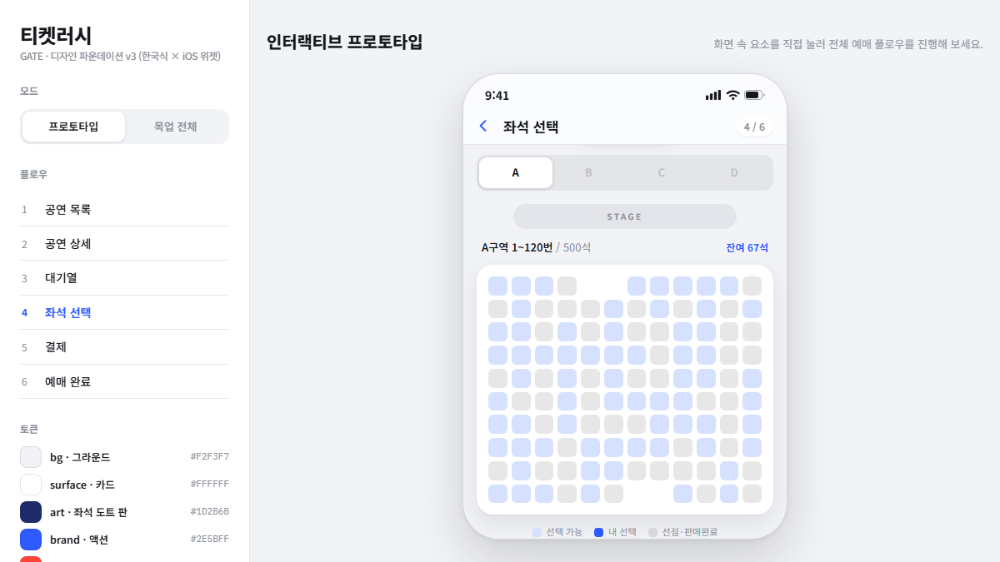
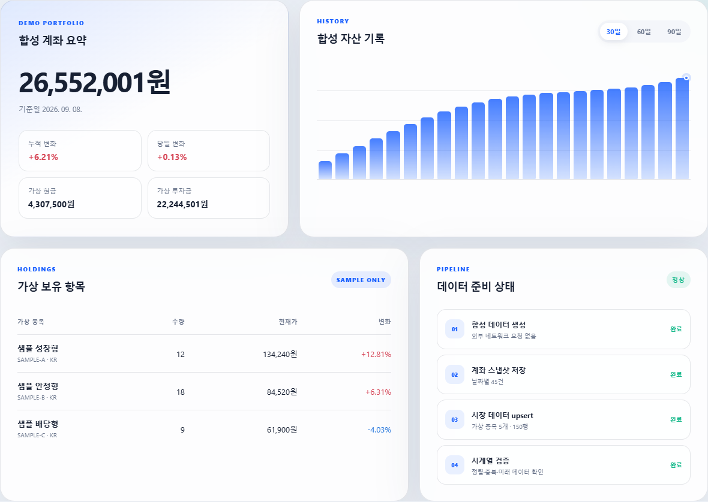
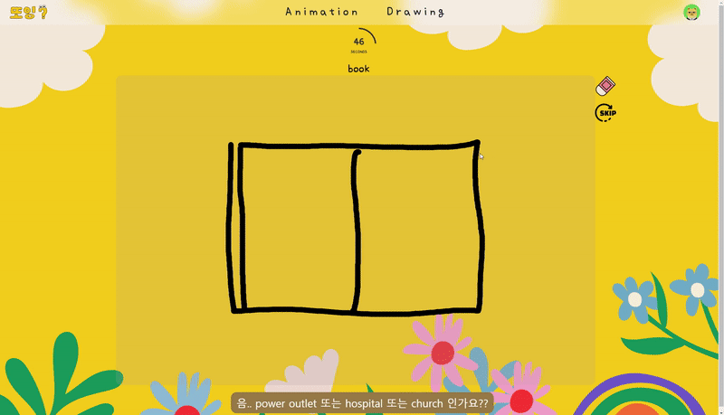
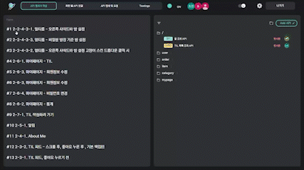

# 권용재 · Yongjae Kwon

**Web Developer · Java / Spring**

B2B·공공 업무 시스템의 화면·API·SQL을 개발하고, 검수와 배포까지 담당합니다.

[포트폴리오 ↗](https://www.yongjaekwon.com/) · [백엔드 이력서](https://www.yongjaekwon.com/resume-backend.pdf) · [프론트엔드 이력서](https://www.yongjaekwon.com/resume.pdf) · [이메일](mailto:yongjae116@gmail.com)

## Projects

<table>
<tr>
<td width="50%"><h3><a href="https://github.com/YongjaeKwon/ticket-rush">티켓러시</a></h3>대기열부터 좌석 선택·예매까지</td>
<td width="50%"><h3><a href="https://github.com/YongjaeKwon/quant-lab">데이터 대시보드</a></h3>합성 데이터의 저장·검증·조회</td>
</tr>
<tr>
<td width="50%" align="center"></td>
<td width="50%" align="center"></td>
</tr>
<tr>
<td width="50%" valign="top">

Redis의 좌석 선점과 DB의 최종 확정을 나누고, 동시 요청·만료·재시도를 테스트합니다.

<code>Java</code> <code>Spring Boot</code> <code>Redis</code> <code>MySQL</code>

개인 · 개발 중 · 위 이미지는 디자인 프로토타입 <a href="https://github.com/YongjaeKwon/ticket-rush">코드와 테스트 보기 →</a>

</td>
<td width="50%" valign="top">

같은 날짜의 데이터를 중복 없이 갱신하고, 입력 검증부터 조회 화면까지 연결했습니다.

<code>Python</code> <code>FastAPI</code> <code>React</code> <code>TypeScript</code>

개인 · 실제 실행 화면 · 모든 데이터는 합성 데이터 <a href="https://github.com/YongjaeKwon/quant-lab">코드와 실행 방법 보기 →</a>

</td>
</tr>
</table>

<table>
<tr>
<td width="50%"><h3><a href="https://github.com/GomGom-Team/ddoing">또잉</a></h3>그림을 그리며 배우는 영어 학습 서비스</td>
<td width="50%"><h3><a href="https://github.com/SSAFAST/ssafast">SSAFAST</a></h3>API 명세 작성과 테스트를 연결하는 개발 도구</td>
</tr>
<tr>
<td width="50%" align="center"></td>
<td width="50%" align="center"></td>
</tr>
<tr>
<td width="50%" valign="top">

<strong>담당</strong> Canvas 그림 입력, 타이머와 AI 판별 API 연동, 점수·게임 상태 관리

<code>React</code> <code>TypeScript</code> <code>Canvas</code>

SSAFY 팀 프로젝트 <a href="https://github.com/GomGom-Team/ddoing">프로젝트 보기 →</a>

</td>
<td width="50%" valign="top">

<strong>담당</strong> 동적 API 명세 입력 폼과 성능 테스트 화면

<code>Next.js</code> <code>React</code> <code>TypeScript</code>

SSAFY 팀 프로젝트 · 원본 서비스 시연 <a href="https://github.com/SSAFAST/ssafast">프로젝트 보기 →</a>

</td>
</tr>
</table>

## Work

**PPS · B2B 협력사 포털** 
첨부파일 300~400건의 압축을 비동기 작업으로 분리하고, 진행 상태와 새로고침 이후 결과를 화면에서 확인할 수 있게 했습니다.

**TSMS · 교육용 단말 운영 시스템** 
25개 화면의 외부 API 호출을 공통 서버 경로로 옮겼습니다. 단말 등록 전 검증과 QR 발급, 현장 점검·재점검 업무도 개발했습니다.

사내 코드는 비공개이며, 담당 범위와 구현 배경은 [포트폴리오의 상세 사례](https://www.yongjaekwon.com/#projects)에 정리했습니다.

[포트폴리오 소스 코드](https://github.com/YongjaeKwon/portfolio) · [MODAC — 스터디룸·학습 기록 팀 프로젝트](https://github.com/YongjaeKwon/MODAC)
