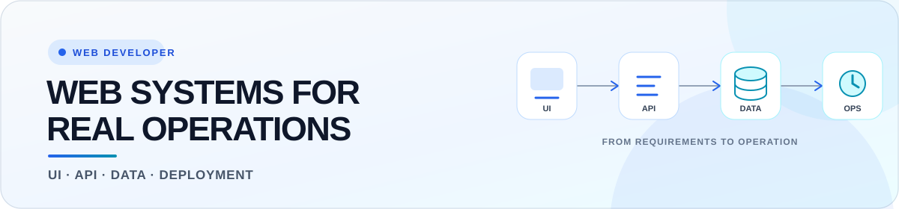

  <picture>
    <source media="(prefers-color-scheme: dark) and (max-width: 640px)" srcset="./assets/profile-header-mobile-dark.svg">
    <source media="(prefers-color-scheme: light) and (max-width: 640px)" srcset="./assets/profile-header-mobile-light.svg">
    <source media="(prefers-color-scheme: dark)" srcset="./assets/profile-header-dark.svg">
    <source media="(prefers-color-scheme: light)" srcset="./assets/profile-header-light.svg">
    
  </picture>

# 권용재 · Yongjae Kwon

**Web Developer**

업무 담당자와 요구사항을 정리한 뒤 화면, API, 데이터 처리와 배포까지 이어서 개발합니다. 현재 B2B 협력사 포털과 교육용 스마트기기 사업 운영 시스템을 맡고 있으며, 기능을 만든 뒤 실제 사용 과정에서 생기는 불편까지 확인하고 개선하고 있습니다.

[Portfolio ↗](https://www.yongjaekwon.com/) · [Resume ↓](https://www.yongjaekwon.com/resume.pdf) · [Email](mailto:yongjae116@gmail.com)

## 실무에서 맡고 있는 시스템

### 협력사 포털 (PPS)

약 500개 협력사와 800여 개 활성 현장 엔지니어 계정이 파트너 등록, 계약, 교육과 문서 업무에 사용하는 B2B 포털입니다. 화면·API 개발부터 배포와 운영까지 맡고 있습니다.

- 300~400건의 첨부파일을 한 번에 내려받을 때 요청이 장시간 유지되던 흐름을 비동기 작업과 상태 조회 방식으로 변경했습니다.
- 기능별로 흩어져 있던 알림 발송 조건과 수신자 정보를 공통 정책으로 모아 운영 설정으로 제어할 수 있게 했습니다.

### 교육용 스마트기기 사업 운영 시스템 (TSMS)

11만여 대의 교육용 단말 정보와 보급, 설치, A/S, 점검 업무를 관리하는 시스템입니다. 현업 요구사항 협의부터 신규 기능 개발, 사용자 검수와 배포까지 담당합니다.

- 브라우저에 노출되던 외부 API 키를 서버 프록시로 옮기고 25개 화면의 호출 경로를 공통화했습니다.
- 사이트별 URL 규칙을 설정으로 관리하고 게시글 ID 추출, 중복 확인과 의심 게시물 이력 저장을 한 흐름으로 구성했습니다.

*사내 프로젝트의 고객사 정보, 실제 화면과 저장 데이터는 공개하지 않습니다. 구현 배경과 역할은 [포트폴리오의 프로젝트 상세](https://www.yongjaekwon.com/#projects)에 정리했습니다.*

## 개인·팀 프로젝트

### [ReachRich Public Lab](https://github.com/YongjaeKwon/quant-lab)

비공개 개인 프로젝트 ReachRich의 데이터 저장·검증·조회·화면 흐름을 합성 데이터로 재구성한 공개 기술 데모입니다. 실제 계좌, 전략과 투자 성과는 포함하지 않습니다.

`Python` `FastAPI` `SQLAlchemy` `SQLite` `Parquet` `React` `TypeScript` `pytest` `Vitest`

### [Portfolio](https://github.com/YongjaeKwon/portfolio)

실무와 개인·팀 프로젝트를 전체·프론트엔드·백엔드 관점으로 살펴볼 수 있게 구성한 포트폴리오입니다. 공개 가능한 범위에서 문제, 구현과 운영 경험을 상세 사례로 정리했습니다.

`Vue` `TypeScript` `Vite` · [Live site ↗](https://www.yongjaekwon.com/)

### [ddoing](https://github.com/GomGom-Team/ddoing)

그림으로 영어 단어를 학습하는 팀 프로젝트입니다. Canvas 그림 입력, AI 판별 API 연계, 점수와 게임 상태가 이어지는 프론트엔드 흐름을 구현했습니다.

`React` `TypeScript` `Redux Toolkit` `Canvas API`

<strong>다른 팀 프로젝트 보기</strong>

### [SSAFAST](https://github.com/SSAFAST/ssafast)

API 명세 작성부터 요청·유스케이스·성능 테스트 결과 확인까지 연결한 개발 지원 도구입니다. 동적 명세 입력과 성능 테스트 화면을 담당했습니다.

`Next.js` `React` `TypeScript` `React Hook Form`

### [MODAC](https://github.com/YongjaeKwon/MODAC)

학습 기록과 스터디 활동을 관리하는 팀 프로젝트입니다. 스터디룸, 게시글과 마이페이지 화면을 개발하고 실시간 참여 상태를 연동했습니다.

`Vue` `Pinia` `SockJS` `STOMP`

## 기술

**실무에서 사용**

- Backend · `Java` `Spring Boot` `Spring MVC` `Spring Security` `MyBatis`
- Frontend · `JavaScript` `Vue` `WebSquare5` `JSP` `jQuery`
- Data & Operations · `Oracle` `MariaDB` `MySQL` `Tomcat` `Linux` `Jenkins` `Maven` `Gradle` `Git` `SVN`

**개인·팀 프로젝트에서 사용**

- Frontend · `React` `TypeScript` `Next.js`
- Backend & Data · `Python` `FastAPI` `SQLAlchemy` `SQLite` `Parquet`
- Test & Automation · `pytest` `Vitest` `GitHub Actions`

---

더 자세한 경력과 프로젝트는 [www.yongjaekwon.com](https://www.yongjaekwon.com/)에서 확인할 수 있습니다.

연락은 [yongjae116@gmail.com](mailto:yongjae116@gmail.com)으로 부탁드립니다.
