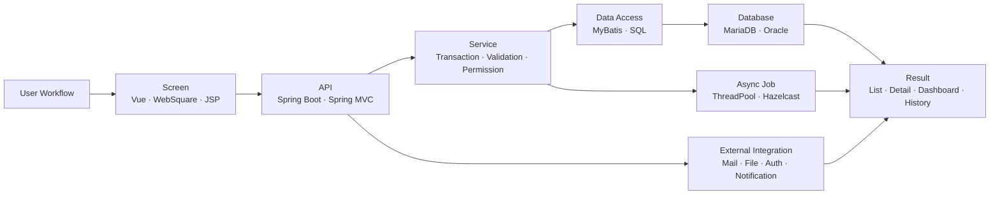

<!-- ============================ HERO ============================ -->
<a href="https://www.yongjaekwon.com">
  
</a>

<h3 align="center">운영 중인 시스템의 구조를 바꿔서 문제를 푸는 백엔드 개발자</h3>

<p align="center">
  장시간 동기 요청, 다중 인스턴스, 코드에 박힌 민감 정보처럼<br/>
  임시 대응으로 넘기기 쉬운 문제를 구조 변경으로 해결해 왔습니다.
</p>

<p align="center">
  <a href="https://www.yongjaekwon.com">
    
  </a>
  <a href="https://www.yongjaekwon.com/resume.pdf">
    
  </a>
  <a href="https://github.com/YongjaeKwon/quant-lab">
    
  </a>
  <a href="mailto:yongjae116@gmail.com">
    
  </a>
</p>

---

## 한눈에 보는 소개

| | |
| --- | --- |
| **현재 역할** | 웹 개발자, 유한책임회사 티지나래 · 2024.06 ~ 재직 중 |
| **담당 시스템** | 약 500개 파트너사가 쓰는 B2B 운영 포탈(PPS), 여러 교육청·공공사업의 장비 생애주기 통합 시스템(TSMS) |
| **주요 경험** | 비동기 작업 구조 전환, 다중 인스턴스 상태 공유, 트랜잭션 경계 설계, 외부 시스템 연계, 배포 파이프라인 구성 |
| **지원 트랙** | 백엔드 개발자 · 풀스택 웹 개발자 |
| **실무 기술** | Java, Spring Boot, Spring MVC, Spring Security, MyBatis, JPA, MariaDB, Oracle, Jenkins, Hazelcast, Vue, JSP, WebSquare5 |
| **개인 프로젝트 기술** | FastAPI, PostgreSQL, Redis, Docker Compose, React, TypeScript, Next.js |
| **자격** | SQLD (SQL 개발자) · 2024.09 취득 |

> 실무 내용은 보안상 공개 가능한 범위에서만 정리했습니다. 내부 코드, 화면, 고객 데이터, 회사 민감 정보는 포함하지 않습니다.

## 소개

외주로 구축·운영되던 두 개의 실사용 시스템을 사내로 인수해 개발·운영을 내재화했고, 2025년 10월부터 B2B 포탈의 개발·운영·배포 주담당을 맡고 있습니다.

기능을 붙이는 것보다 **왜 이 구조가 이렇게 되어 있는지**를 먼저 봅니다. 한 요청이 10분씩 붙잡혀 있으면 응답을 기다리게 만드는 대신 작업을 분리하고, 키가 화면 스크립트에 박혀 있으면 서버로 회수합니다. 요구받은 방식에 리스크가 보이면 대안을 만들어 제안합니다.

```text
I build calm, traceable web systems for messy business workflows.
```

## 대표 작업

| 작업 | 문제 | 해결 |
| --- | --- | --- |
| **대량 압축 다운로드 비동기 전환** | 300~400건 첨부파일을 단일 HTTP 요청에서 처리해 완료까지 10분 이상 스레드 점유 | 작업 ID 발급 후 전용 스레드풀로 분리, Hazelcast 분산 맵으로 다중 WAS 간 상태 공유, 스트리밍 전송과 만료 회수 |
| **계정 발급·사내 시스템 연계 모듈** | 계정을 두 시스템에 각각 생성하고 ID를 DB에 직접 삽입하던 구조 | 생성 창구를 한 곳으로 통합하고 API 전송으로 재구축, 단일 트랜잭션과 사전 검증으로 정합성 확보 |
| **외부 API 서버 프록시 전환** | 화면 스크립트가 외부 API를 직접 호출해 REST 키가 클라이언트에 노출 | 공통 API 계층을 신규 작성해 서버 프록시로 전환, 키를 서버 설정으로 이관하고 25개 화면 전수 교체 |
| **알림 발송 정책 공통화** | 발송 조건과 수신자가 5개 서비스에 하드코딩, 관리자 연락처까지 소스에 노출 | 정책 데이터로 추출해 공통 발송 서비스로 통합, 배포 없이 설정으로 제어 |
| **Jenkins 배포 파이프라인 구성** | 전용 배포 서버 없이 빌드·전송·인스턴스 교체를 매번 수동 반복 | 선언형 파이프라인으로 묶어 개발 218회·운영 148회 배포에 사용, 1회 평균 44초 |

## 일하는 방식

| 영역 | 방식 |
| --- | --- |
| **구조 판단** | 기능을 붙이기 전에 지금 구조가 왜 이런지, 바꿔야 하는지 먼저 확인합니다. |
| **민감 정보** | 코드·클라이언트에 박힌 키, 연락처, 식별자를 서버와 설정으로 회수합니다. |
| **경계 설계** | 트랜잭션 범위, 검증 위치, 인증 대상을 나눠 클라이언트 우회 가능성을 없앱니다. |
| **운영 확인** | 배포로 끝내지 않고 운영 데이터를 조회해 실제로 의도대로 동작하는지 확인합니다. |
| **요구 재검토** | 요구받은 방식에 기술적·정책적 리스크가 있으면 대안을 설계해 제안합니다. |

## 공개 프로젝트

| 프로젝트 | 보여주는 내용 | 링크 |
| --- | --- | --- |
| **Portfolio** | 직무 트랙별 포트폴리오와 이력서 PDF. Vue 3 + TypeScript로 직접 구현 | [Live](https://www.yongjaekwon.com) · [Repo](https://github.com/YongjaeKwon/portfolio) |
| **quant-lab** | 개인 프로젝트(quant-core)에서 공개 가능한 구조만 분리한 FastAPI 백엔드 쇼케이스 | [Repo](https://github.com/YongjaeKwon/quant-lab) |
| **SSAFAST** | Next.js API 협업 플랫폼. 중첩 DTO 동적 폼, 부하 테스트 결과 UI | [Repo](https://github.com/SSAFAST/ssafast) |
| **ddoing** | React·TypeScript Canvas 학습 게임, AI 추론 API 연동 | [Repo](https://github.com/GomGom-Team/ddoing) |
| **MODAC** | Vue 3 · Pinia · WebSocket 기반 학습 룸·피드 UI | [Repo](https://github.com/YongjaeKwon/MODAC) |

## 기술 스택

<table>
  <tr>
    <td><b>Backend</b></td>
    <td>Java · Spring Boot · Spring MVC · Spring Security · Spring Async · MyBatis · JPA · REST API</td>
  </tr>
  <tr>
    <td><b>비동기 · 분산</b></td>
    <td>ThreadPoolTaskExecutor · Hazelcast · StreamingResponseBody · 다중 WAS 인스턴스</td>
  </tr>
  <tr>
    <td><b>Database</b></td>
    <td>MariaDB · Oracle · MySQL · PostgreSQL · Redis · 다중 데이터소스</td>
  </tr>
  <tr>
    <td><b>Build · Deploy</b></td>
    <td>Jenkins · Gradle · Maven · Tomcat · Linux · SSH/SFTP · Docker Compose</td>
  </tr>
  <tr>
    <td><b>Frontend</b></td>
    <td>Vue.js · JavaScript · TypeScript · React · Next.js · JSP · jQuery · WebSquare5</td>
  </tr>
  <tr>
    <td><b>Tools · AI</b></td>
    <td>Git · SVN · Jira · Confluence · Codex · Claude Code</td>
  </tr>
</table>

## 시스템 관점


```mermaid
flowchart LR
  A["User Workflow"] --> B["Screen<br/>Vue · WebSquare · JSP"]
  B --> C["API<br/>Spring Boot · Spring MVC"]
  C --> D["Service<br/>Transaction · Validation · Permission"]
  D --> E["Data Access<br/>MyBatis · SQL"]
  E --> F["Database<br/>MariaDB · Oracle"]
  C --> G["External Integration<br/>Mail · File · Auth · Notification"]
  D --> I["Async Job<br/>ThreadPool · Hazelcast"]
  F --> H["Result<br/>List · Detail · Dashboard · History"]
  G --> H
  I --> H
```

<details>
  <summary><b>GitHub 활동</b></summary>
  <br/>
  <p align="center">
    
  </p>
  <p align="center">
    
    
    
  </p>
</details>


