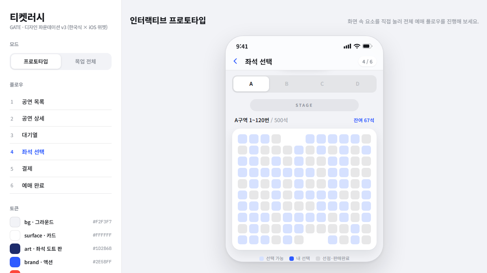
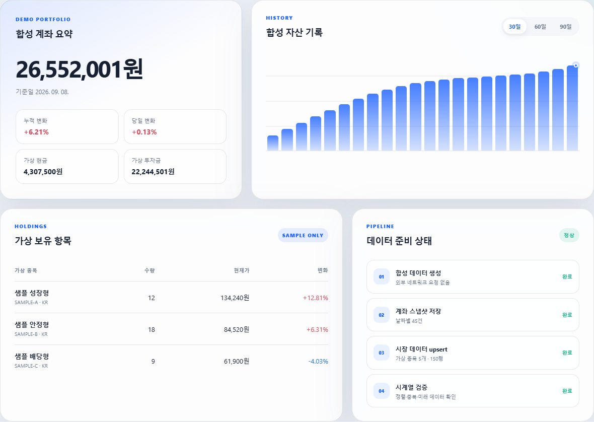
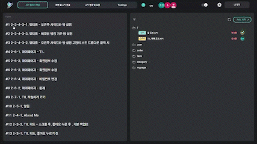
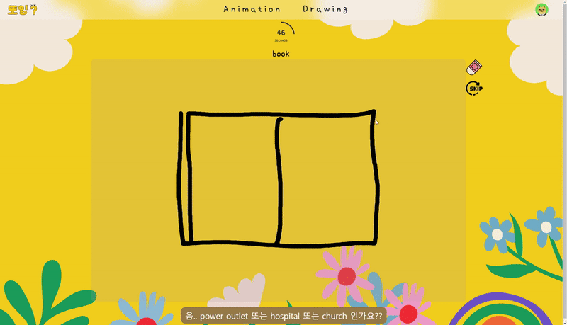

# 권용재 · Yongjae Kwon

운영 중인 공공 · B2B 업무 시스템에서 화면부터 서버와 DB까지 만드는 웹 개발자입니다. 요구사항을 정리하는 단계부터 배포한 기능이 실제로 쓰이는지 확인하는 단계까지 맡고 있습니다.

[포트폴리오 사이트](https://www.yongjaekwon.com/) · [이력서 PDF](https://www.yongjaekwon.com/resume.pdf) · [포트폴리오 PDF](https://www.yongjaekwon.com/portfolio.pdf) · yongjae116@gmail.com

## 실무에서 낸 결과

| 결과 | 한 일 | 시스템 |
| --- | --- | --- |
| 60초 안에 끝나지 않던 조회를 **63~69ms**로 | 고객 조건이 통합 뷰 안까지 전달되지 않는 것을 실행계획에서 확인하고 화면이 쓰는 컬럼만 기본 테이블 조인으로 다시 썼으며 운영 DB에서 전후 결과가 같은지 비교했습니다. | 교육용 단말 운영 시스템 |
| 첨부파일 **300~400건** 압축을 진행 상태가 보이는 작업으로 | 한 요청에서 압축하느라 화면이 멈추던 흐름을 작업 ID 기반 비동기 작업으로 나눴습니다. 서버 2대 어디서 조회해도 같은 상태가 보이고 새로고침해도 이어서 받습니다. | B2B 협력사 포털 |
| 교육용 단말 **108,237대**에 QR 발급 | 대량 등록 전에 생산입고 정보와 기등록 여부를 대조하고 QR에는 내부 식별자 대신 외부 노출용 ID를 넣었습니다. | 교육용 단말 운영 시스템 |

두 시스템 모두 사내 프로젝트라 코드는 공개하지 않습니다. 문제와 판단 과정은 [포트폴리오의 경력 사례](https://www.yongjaekwon.com/#experience)에 적어 두었습니다.

## 프로젝트

<table>
<tr>
<td width="50%" valign="top">

<h3><a href="https://github.com/YongjaeKwon/ticket-rush">티켓러시</a></h3>

선착순 예매에서 같은 좌석이 두 번 팔리지 않는지를 테스트로 확인하며 만드는 예매 시스템입니다. 좌석 하나에 동시 요청 100건을 보내면 예매 성공은 1건입니다.

<code>Java</code> <code>Spring Boot</code> <code>Redis</code> <code>MySQL</code> <code>Next.js</code>

개인 · 개발 중 · 이미지는 디자인 프로토타입

</td>
<td width="50%" valign="top">

<h3><a href="https://github.com/YongjaeKwon/quant-lab">quant-lab</a></h3>

비공개 개인 프로젝트 ReachRich의 저장 · 검증 · 조회 흐름을 합성 데이터로 옮긴 공개 데모입니다. 같은 작업을 다시 돌려도 데이터가 중복되지 않습니다.

<code>Python</code> <code>FastAPI</code> <code>React</code> <code>TypeScript</code>

개인 · 실제 실행 화면 · 모든 데이터는 합성 데이터

</td>
</tr>
<tr>
<td width="50%" valign="top">

<h3><a href="https://github.com/SSAFAST/ssafast">SSAFAST</a></h3>

API 명세를 쓰고 바로 요청과 성능 테스트까지 해 보는 도구입니다. 반복 · 중첩 입력을 다루는 명세 폼과 테스트 결과 화면을 맡았습니다.

<code>Next.js</code> <code>React</code> <code>TypeScript</code>

SSAFY 팀 프로젝트(6인) · 프론트엔드

</td>
<td width="50%" valign="top">

<h3><a href="https://github.com/GomGom-Team/ddoing">또잉</a></h3>

영어 단어를 보고 그림을 그리면 AI 판정에 따라 학습이 이어지는 서비스입니다. Canvas 그림 입력과 판정 서버 연동, 타이머와 점수 상태를 맡았습니다.

<code>React</code> <code>TypeScript</code> <code>Canvas</code>

SSAFY 팀 프로젝트 · 프론트엔드

</td>
</tr>
</table>

그 밖에 오프라인 소개팅을 실제로 운영하려고 만들고 있는 **오늘사이**(비공개, NestJS · Next.js · PostgreSQL)와 팀 프로젝트 [MODAC](https://github.com/YongjaeKwon/MODAC)이 있습니다. 두 프로젝트와 실무 사례는 [포트폴리오](https://www.yongjaekwon.com/#projects)에서 볼 수 있고 포트폴리오 사이트 코드는 [여기](https://github.com/YongjaeKwon/portfolio)에 있습니다.

## 주로 쓰는 기술

- **화면**: Vue, React, Next.js, TypeScript, WebSquare
- **서버**: Java, Spring Boot, Spring MVC, MyBatis, Python, FastAPI
- **데이터**: Oracle, MariaDB, MySQL, PostgreSQL, Redis
- **테스트 · 배포**: Vitest, Playwright, Testcontainers, GitHub Actions, Jenkins
